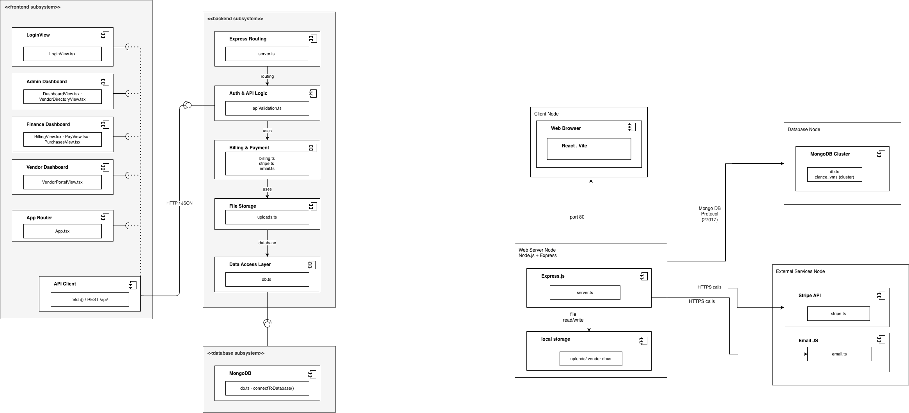
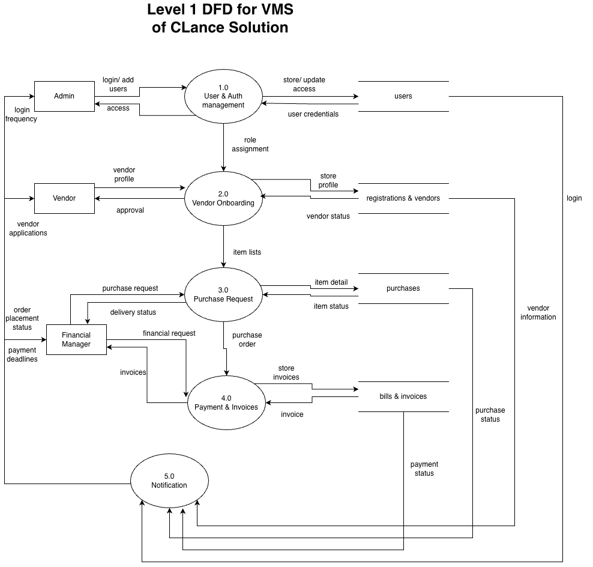
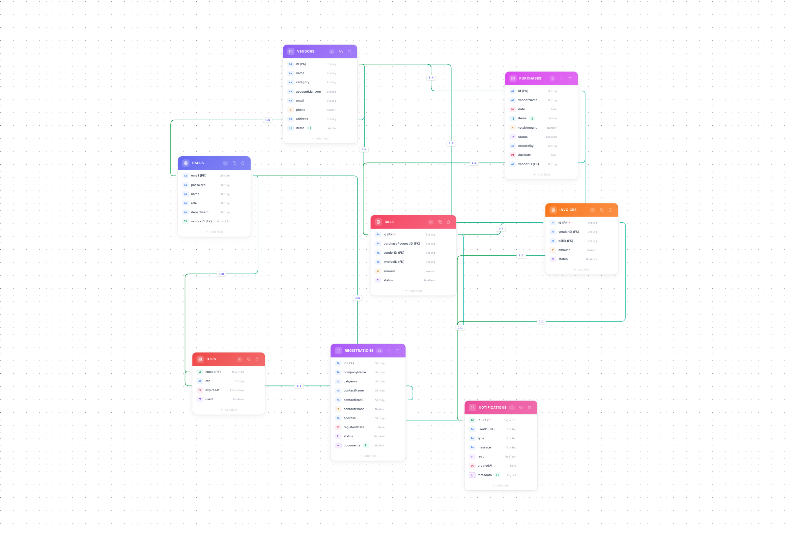

# CLance Solutions - Vendor Management System (VMS)

A full-stack, enterprise-grade Vendor Management System (VMS) built with React, TypeScript, Express, and MongoDB. The system provides secure, role-based portals for Administrators, Financial Managers, and Vendors to manage vendor directories, verify registrations, process procurement purchase requests, track invoices, and execute payments.

---

## Tech Stack

*   **Frontend**: React 19, TypeScript, Vite, Tailwind CSS v4, Lucide Icons
*   **Backend**: Express.js (Node.js), TypeScript
*   **Database**: MongoDB (via Native Node.js Driver)
*   **Payments**: Stripe API Integration
*   **Notifications**: EmailJS & In-App Short-Polling Alert System

---

## System Diagrams

### Component & Deployment Architecture


### Data Flow Diagram (Level 1)


### MongoDB Schema Layout


---

## Key Features

### 1. Role-Based Access Control (RBAC)
*   **Admin Portal**: Review pending registrations, upload and audit business verification documents, approve/reject vendors, and inspect overall vendor metrics.
*   **Financial Manager Portal**: Create purchase requests, review invoice history, manage bills, and settle payments.
*   **Vendor Portal**: Manage catalog offerings, update contact coordinates, fulfill incoming purchase orders, and track invoice statuses.

### 2. Digital Ledger & Payment Gateway
*   Seamlessly binds purchase requests to active bills and invoices.
*   Integrates with the **Stripe API** to authorize and confirm payment transactions securely.
*   Generates raw binary PDF invoices dynamically on payment completion for local storage and client download.

### 3. Automated Onboarding
*   Prospective vendors submit company documents (Business License, W-9 tax forms) via a self-registration flow.
*   Admins review verification PDF documents directly within the dashboard using inline rendering.

### 4. Interactive Theme & UI
*   Custom light, dark, and system-preference modes.
*   Persisted layout preferences (such as custom scrollbar visibility options) in local storage.

---

## Getting Started

### Prerequisites
*   Node.js (v18 or higher)
*   MongoDB (running locally or accessed via MongoDB Atlas)

### Setup Instructions
1.  Clone or navigate to the project directory:
    ```bash
    cd clance-solutions-vms
    ```
2.  Install dependencies:
    ```bash
    npm install
    ```
3.  Create a `.env` file in the root directory:
    ```env
    MONGODB_URI=your_mongodb_connection_string
    MONGODB_DB_NAME=clance_vms
    PORT=3000
    ```

### Running the Application

#### Development Mode
Start the local server with hot module reloading (HMR) powered by Vite:
```bash
npm run dev
```
The application will be available at `http://localhost:3000`.

#### Production Mode
Build frontend bundles and package server entry points:
```bash
npm run build
```
Launch the compiled production web server:
```bash
npm start
```

---

## Available Scripts

| Script            | Description                                                 |
| ----------------- | ----------------------------------------------------------- |
| `npm run dev`     | Starts Express backend with live Vite asset compilation.    |
| `npm run build`   | Bundles client code with Vite and server code with esbuild. |
| `npm start`       | Runs the compiled production build from `dist/server.cjs`.   |
| `npm run preview` | Previews the compiled static assets.                        |
| `npm run lint`    | Runs the TypeScript compiler in check-only mode.            |
| `npm test`        | Runs unit and integration tests using Vitest.               |

---

## API Endpoints

### Authentication
*   `POST /api/auth/login` - Authenticates user credentials and checks active roles.

### Vendors & Catalogs
*   `GET /api/vendors` - Lists all registered vendors.
*   `GET /api/vendors/:id` - Gets vendor profile details.
*   `POST /api/vendors` - Adds a new vendor profile.
*   `PUT /api/vendors/:id` - Updates vendor profile or catalog items.
*   `DELETE /api/vendors/:id` - Removes a vendor profile.

### Invoices & Bills
*   `GET /api/payments` - Retrieves invoice history.
*   `GET /api/invoices/:id/pdf` - Streams raw PDF invoice.
*   `POST /api/invoices` - Creates a new invoice.
*   `PUT /api/invoices/:id` - Modifies invoice parameters.
*   `DELETE /api/invoices/:id` - Deletes an invoice record.
*   `POST /api/bills/:id/pay` - Confirms bill payment via Stripe.

### Onboarding Registrations
*   `GET /api/registrations` - Lists pending onboarding requests.
*   `POST /api/registrations` - Submits a new vendor onboarding request.
*   `GET /api/registrations/:id/documents/:type` - Streams verification documents inline.
*   `POST /api/registrations/approve` - Approves registration (registers vendor & user accounts).
*   `POST /api/registrations/reject` - Rejects registration.

### Procurement Purchase Requests
*   `GET /api/purchases` - Lists all purchase requests.
*   `POST /api/purchases` - Submits a new purchase request.
*   `PUT /api/purchases/:id` - Updates purchase request details or status.
*   `DELETE /api/purchases/:id` - Deletes a purchase request.
